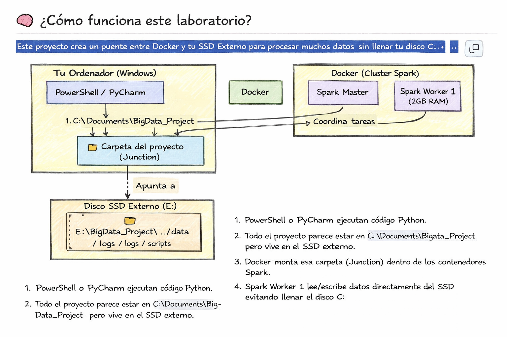
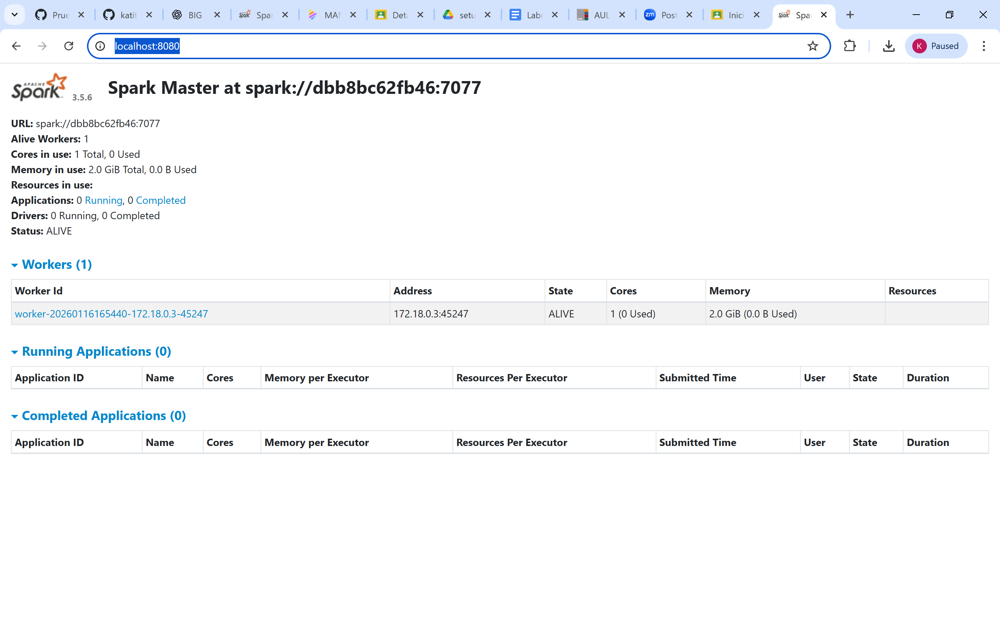

# Big Data Lab (Spark + Docker) con SSD externo (Windows)

Repositorio para montar un mini laboratorio de Big Data usando **Apache Spark** en contenedores Docker, evitando que el disco **C:** se llene al guardar datos y resultados en un **SSD externo** mediante un **Directory Junction** en Windows.

---

## Objetivo
- Ejecutar Spark sin instalar dependencias pesadas en el sistema.
- Guardar datasets/resultados en el SSD externo.
- Conectar y lanzar pruebas desde **PyCharm** (Python local) hacia Spark (Docker).

---

## Requisitos
- Windows 10/11
- Docker Desktop (abierto y en verde)
- Python 3.x
- (Para la prueba) `pyspark` en tu entorno local:
  ```bash
  pip install pyspark
  

## Arquitectura (simple)
- `spark-master` (Docker) expone:
  - `8080`: Spark UI
  - `7077`: endpoint para que el cliente (PyCharm) envíe jobs
- `spark-worker-1` (Docker) ejecuta tareas (ajustado a laptop con 8GB RAM)
- `data/` montado como volumen para leer/escribir datasets

## 🧠 ¿Cómo funciona este laboratorio?



*Diagrama de la arquitectura del laboratorio Big Data.  
El proyecto se ejecuta en Windows, Spark corre en Docker y los datos se almacenan
físicamente en un SSD externo mediante un Directory Junction.*

## 🌐 Interfaz web de Apache Spark (Spark UI)

Una vez el clúster Spark está en ejecución, Apache Spark expone una
interfaz web para monitorizar el estado del sistema.

La interfaz se encuentra disponible en: http://localhost:8080
